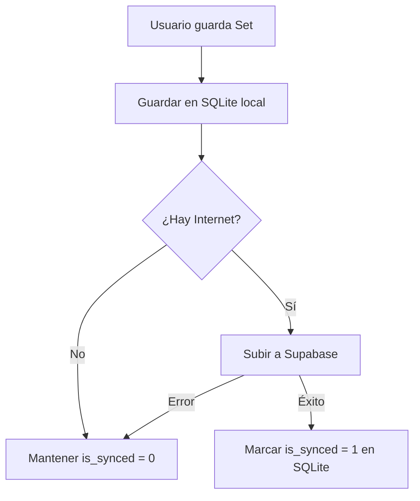

# Arquitectura Offline-First: Smart Gym Tracker

Esta documentación describe la implementación técnica del soporte fuera de línea (Offline-First) en la aplicación, integrando Clean Architecture, programación funcional y persistencia local.

## 🟢 Objetivos de la Arquitectura
- **Funcionamiento Ininterrumpido**: Permitir al usuario registrar entrenamientos sin importar el estado de la red.
- **Sincronización Automática**: Subir datos pendientes al servidor de forma silenciosa al recuperar la conexión.
- **Experiencia de Usuario Fluida**: Cargar perfiles y entrenamientos cacheados instantáneamente al abrir la app.

---

## 🛠️ Stack Tecnológico
- **Base de Datos Local**: `sqflite` (SQLite para Flutter).
- **Programación Funcional**: `fpdart` (Uso de `Either` para manejo de errores).
- **Monitoreo de Red**: `internet_connection_checker_plus`.
- **Caché de Preferencias**: `shared_preferences`.

---

## 🏗️ Capas de Implementación

### 1. Capa de Dominio (Domain)
Se ha migrado al uso de **Programación Funcional** para eliminar el uso de excepciones.
- **Failures**: Definición de fallos (`ServerFailure`, `CacheFailure`, `NetworkFailure`).
- **Either**: Los UseCases y Repositorios retornan `Future<Either<Failure, T>>`, forzando al programador a manejar tanto el éxito como el error.

### 2. Capa de Datos (Data)
Se utiliza una estrategia de **Doble Fuente de Datos**:
- **WorkoutRemoteDataSource**: Comunicación directa con Supabase.
- **WorkoutLocalDataSource**: Persistencia en SQLite local.
- **WorkoutRepositoryImpl**: Orquestador que decide el flujo:
    - **Lecturas**: Intenta remoto; si falla o no hay red, devuelve local.
    - **Escrituras (Offline-First)**: Siempre guarda localmente primero (con `is_synced = 0`) e intenta subir al remoto de inmediato. Si falla, el registro queda marcado para sincronización posterior.

### 3. Sistema de Sincronización (Sync)
La sincronización se maneja mediante el `SyncService`:
- Escucha cambios de conectividad.
- Al detectar `InternetStatus.connected`, dispara el método `syncPendingData()` del repositorio.
- Los registros se marcan como `is_synced = 1` solo tras la confirmación del servidor.

### 4. Perfiles Offline
El perfil del usuario se persiste usando `AuthLocalDataSource` (SharedPreferences):
- Guarda el JSON del usuario al hacer login/registro.
- `AuthRepository` devuelve el usuario cacheado si falla la conexión, evitando que el usuario sea expulsado de la sesión por falta de red.

---

## 📋 Diagrama de Flujo de Escritura

---

## 📂 Archivos Clave
- `lib/core/database/database_helper.dart`: Configuración de tablas SQLite.
- `lib/core/services/sync_service.dart`: Orquestador de sincronización.
- `lib/features/workout/data/repositories/workout_repository_impl.dart`: Lógica híbrida de datos.
- `lib/features/auth/data/datasources/auth_local_data_source.dart`: Caché de perfil.
